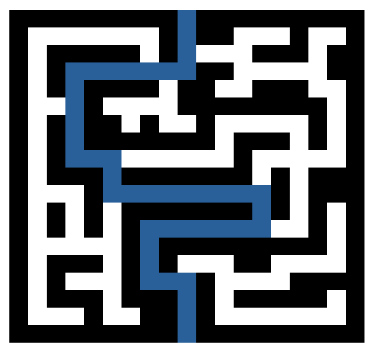

Projeto de jogo com gráficos 3D desenvolvido para a disciplina de Computer Graphics na UFABC.

[Disponível em WebAssembly](https://vinszrt.github.io/miniature-palm-tree/public/)

### Aluno

Vinicius Nunes Zorzetti
11068214

### Descrição do jogo

O jogo é um labirinto em 3D no qual o jogador começa de um lado do labirinto e tem que chegar do outro lado e encontrar o coelho para vencer.

Abaixo tem a imagem do labirinto, onde em azul é um dos caminhos para sair do labiritinto. (No jogo, considera-se que o usuário está na parte de baixo do labirinto e tem que chegar no topo).

### Controles

W ou Seta para frente = Move para frente

W ou Seta para tráz = Move para trás

A ou Seta para esquerda = Vira para esquerda

D ou Seta para a direita = Vira para a direita

Q = Anda lateralmente para esquerda

E = Anda lateralmente para a direita

### Descrição da implementação

Esta é a segunda versão do logo labirinto, a primeira versão foi entregue na atividade anterior.
Código da primeira versão: https://github.com/vinszrt/automatic-sniffle

Esta nova versão foi uma atualização da implementação anterior.

O principal objetivo desta versão foi incluir textura e iluminação.

A implementação inicialmente foi baseada na implementação de "LookAt" para usar o sistema de funcionamento da câmera (que representa o personagem andando pelo labirinto) e o mecanismo de perspectiva. Aproveitou-se também da implementação de "Viewer5" para implementar textura difusa com mapeamento de normais.

O labirinto é representado por uma grade 19x19, onde cada posição é espaçada por 1.0f unidades.

Em cada célula dessa grade do labirinto, pode conter ou não um bloco, representando um trecho de parede do labirinto. Esse bloco havia sido representado anteriormente pelo objeto box.obj da implementação "Starfield", porém, optou-se por atualizar pelo objeto chamferbox.obj da implementação "Viewer5".

Por praticidade, optou-se por utilizar os arquivos brick\_\*.jpg para textura e mapeamento de normais, já fornecido em "Viewer5".

Quanto o usuário se move, ele altera a posição da câmera. Já os blocos das paredes do labirinto permanecem fixas.

A colisão com uma parede é detectada a partir da distância entre a posição da câmera e a posição do centro do bloco de parede, quando essa distância é menor que 0.81f, consideramos que há uma colisão. (Esse valor é a distância do centro de um bloco 1x1 até um vértice de sua extremidade). Para o cálculo dessa distância, considerou-se as posições das projeções da posição da câmera e da parede no chão.

O sistema de colisão foi implementado nas funções de movimentação da câmera, antes de movimentar a câmera, verifica-se se a nova posição seria uma posição de colisão, se for, não faz nada, caso contrário, realiza o movimento.

Como a forma utilizada para criar o labirinto implica na instanciação de diversos blocos de parede, e cada bloco precisaria armazenar sua posição para poder calcular a distância da câmera e do objeto, e também cada instancia ter sua própria matriz modelo, portanto, foi aproveitada a implementação de "Starfield".

O controle do jogo, para exibir que o usuário venceu, utilizou-se como base a implementação de "Asteroids".

## Informações adicionais

Jogo desenvolvido usando o framework ABCg. Mais informações abaixo.

## ABCg

======

Development framework accompanying the course MCTA008-17 Computer Graphics at [UFABC](https://www.ufabc.edu.br/).

---

### Credits

ABCg was developed by Harlen Batagelo.

### License

ABCg is licensed under the MIT License. See [LICENSE](https://github.com/hbatagelo/abcg/blob/main/LICENSE) for more information.
